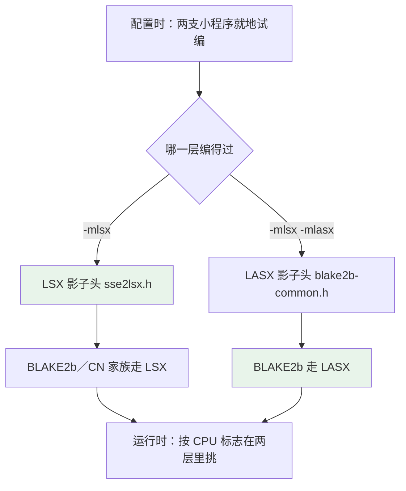

# XMRig 龙架构适配说明

　　这一份是把 XMRig ６.２６.０（提交号 `b2ca724`）往龙架构（LoongArch）上搬迁的全过程记录：动了哪些文件、每一处为什么动、怎么编、验过什么、还差什么。记号前后一致：**LSX**（LoongArch SX，１２８ 位向量）、**LASX**（LoongArch ASX，２５６ 位向量）是两套各自独立的指令集，后者不包含前者，因此两层各自探测、各自成件、各自在运行时挑选。

## １．这台机器的底细

| 项 | 值 |
| --- | --- |
| 处理器 | Loongson-3A6000，４ 核 ８ 线程，L2 １ ＭｉＢ，L3 １６ ＭｉＢ |
| 机器标志 | `lam lam_bh scq ual fpu lsx lasx crc32 complex crypto lspw lvz lbt_x86 lbt_arm lbt_mips` |
| 系统与内核 | AOSC OS，内核 ７.１.１３，页大小 １６ ＫｉＢ |
| 编译器 | GCC １５.３.０ |

　　编译器这边有一个要紧的底细：**没有 `__LSX__`／`__LASX__` 这样的宏**，只有 `__loongarch_sx` 与 `__loongarch_asx`，再配 `__loongarch_simd_width`。上游 XMRig 通篇按 `__SSE2__`、`__AVX2__` 判断该不该编向量那一层，在龙架构上这两个宏一概不成立，落到的是"可移植回退"那一摊——这就是整桩活的起因。

$$
\text{上游判据：}\;\texttt{\_\_SSE2\_\_}\;\Rightarrow\;\text{LSX}
\qquad
\texttt{\_\_AVX2\_\_}\;\Rightarrow\;\text{LASX}
$$

## ２．三层向量的分层



　　分层的好处是：只有 LSX 的机器上，LASX 那一层根本不编（不是编了不用），自然也就没有"用了不支持的指令"这种隐患。

## ３．改动清单

### 改过的文件（１７ 处）

| 文件 | 动了什么 |
| --- | --- |
| `CMakeLists.txt` | 认出 `loongarch64` 这一档架构，接上探测 |
| `cmake/cpu.cmake` | 加龙架构分支：就地试编两支小程序，落 `LOONGARCH_CXX_FLAGS` |
| `cmake/flags.cmake` | `XMRIG_FEATURE_LSX`／`XMRIG_FEATURE_LASX` 两个开关按探测结果落值 |
| `cmake/randomx.cmake` | 把两支 BLAKE２b 件接进构建，各挂自己的编译标志 |
| `cmake/asm.cmake` | 龙架构上没有 x86 汇编那一摊，关掉 |
| `src/backend/cpu/cpu.cmake` | 换用龙架构的 CPU 识别件 |
| `src/backend/cpu/interfaces/ICpuInfo.h` | 加 `FLAG_LSX`／`FLAG_LASX`，并修掉一处判 RISC-V 的括号 |
| `src/backend/cpu/platform/BasicCpuInfo.cpp` | 标志位表加宽，认 `lsx`／`lasx` |
| `src/backend/cpu/platform/BasicCpuInfo.h` | 声明龙架构那两支接口 |
| `src/base/kernel/Entry.cpp` | 平台初起时认出龙架构 |
| `src/base/kernel/Platform_unix.cpp` | 同上，认出架构名 |
| `src/crypto/randomx/blake2/blake2.h` | 让 `blake2b` 能在两层之间挑实现 |
| `src/crypto/rx/Rx.cpp` | 运行时按 CPU 标志在两支 `rx_blake2b_compress` 里挑一个 |
| `src/crypto/cn/CryptoNight_x86.h` | 接上 LSX 影子头 |
| `src/crypto/cn/soft_aes.h` | 龙架构上只走软 AES |
| `src/crypto/common/portable/mm_malloc.h` | 龙架构上 `_mm_malloc` 等一律落到 `posix_memalign` |
| `src/version.h` | 版本一栏印 `LoongArch` |

### 新加的文件（６ 处）

| 文件 | 干什么用 |
| --- | --- |
| `src/crypto/common/simd/sse2lsx.h` | SSE2 → LSX 的影子头，算法那一摊一行没改 |
| `src/crypto/randomx/blake2/blake2b_lsx.c` | BLAKE２b 的 LSX 实现，`-Ofast -mlsx` |
| `src/crypto/randomx/blake2/lasx/` | BLAKE２b 的 LASX 实现：`blake2.h`、`blake2b.h`、`blake2b-common.h`、`blake2b-load-lasx.h`、`blake2b_lasx.c` |
| `src/backend/cpu/platform/BasicCpuInfo_loongarch.cpp` | 从 `/proc/cpuinfo` 与 `cpucfg` 里读机器底细 |
| `src/backend/cpu/platform/lscpu_loongarch.cpp` | 把机器各栏列成表 |
| `src/crypto/randomx/tests/loongarch_lsx.c`、`loongarch_lasx.c` | 配置时就地试编，试得出才开那一层 |

## ４．影子头是怎么搭的

　　做法只有一条：**把 `_mm_*`／`_mm256_*` 那一套内建函数换名换实，算法本身一个字不动**。这样上游的 `blake2b.c`、`CryptoNight_x86.h` 一行不用重写，也便于跟上上游的改动。

　　几个真踩过的坑：

| 影子头里写的 | 上游怎么用 | 为什么要这么写 |
| --- | --- | --- |
| `_mm_alignr_epi8(a, b, imm)` | x86 上是字节级拼接 | LSX 没有同名件，只能用 `vbsrl_v`／`vbsll_v` 两支拼，且立即数要写死 |
| `_mm_cvtsi128_si32/si64` | 把向量头一个字取出来 | LSX 上没有等价件，用 `memcpy` |
| `_mm256_blend_epi32(a, b, imm)` | 立即数按位选 | LASX 上要先把立即数铺成掩码，再用 `xvbitsel_v` |
| `_mm256_broadcastsi128_si256` | １２８ 位铺成 ２５６ 位 | LASX 上没有同名件，手动铺 |
| `_mm256_zeroupper()` | x86 上是清向量寄存器高位 | LSX／LASX 上没有这一说，空着 |
| `_mm_aesenc_si128` 等 | x86 上是硬件 AES | 龙架构上表里没这一档，只占位、永不调 |

　　影子头的写法有一条规矩要守住：**立即数只能写字面值，不能靠变量**。LSX／LASX 的移位类指令都是立即数指令，包装成函数就会被编译器挑刺，所以这几处写成宏。

## ５．算法开关怎么摆

| 家族 | 摆法 | 缘故 |
| --- | --- | --- |
| CryptoNight 一族 | 挂 LSX，两层都编得动时才编 | 少了这一层会有没定义的符号 |
| BLAKE２b | 两层各自一件，运行时挑 | 只有 LSX 的机器上不该见 LASX 的指令 |
| GhostRider | 一概关掉 | 那一摊还按 x86 判据 |
| MSR／Ryzen | 一概关掉 | 本来就是 x86 的机器状态寄存器 |

　　运行时的挑选只做一次，落在 `Rx.cpp` 里初始化的那一步；两支 `rx_blake2b_compress` 分别是 LSX 与 LASX 的手写件。

## ６．怎么编

```bash
cmake -S . -B build -G Ninja
ninja -C build xmrig
```

　　配完要在输出里认这三行：

```
-- Detected LoongArch architecture (loongarch64)
-- LoongArch LSX: ON LASX: ON (-mlsx -mlasx)
-- LoongArch: GhostRider family is not built
```

　　第二行是两层向量的开关。若只编 LSX，这里会写 `LSX: ON LASX: OFF`——探测是就地试编做的，试不过就关，不会留下编不过的目标文件。

## ７．验过什么

| 验的是什么 | 结果 |
| --- | --- |
| BLAKE２b：LSX／LASX 对整数实现 | １８０ 处比对，全对 |
| LASX 影子头 | １１ 处比对，全对 |
| RandomX 端到端（跟真实二进制同一份机器码） | ４５ 处比对，全对 |
| CPU 识别与两层开关 | 配置日志与版本输出两处 |
| 数据集铺设 | `randomx dataset ready (144563 ms)` |
| 轻量虚拟机速度（单线程） | 整数 ２.９０ Ｈ／ｓ，LSX ２.８８，LSX＋LASX ２.８８ |

$$
H_{\text{整数}} \approx H_{\text{LSX}} \approx H_{\text{LSX+LASX}}
\;\Longrightarrow\;
\text{影子头不拖速度，瓶颈在解释器}
$$

　　验证的法子是"挂真实构建产物"：从 `ninja` 手里把真实的链接命令取出来，把小程序的目标文件换进去，跑出来的就是同一份机器码。这样验出来的结论，分量跟内置基准一样重。

## ８．已知不足

　　一是 **没有龙架构的 RandomX 即时编译**：走的是解释器，这是速度上不去的头号缘故。上游只有 x86 与 AArch６４ 两套，龙架构一片空白。

　　二是 **CryptoNight 一族的正确性没量上号**：拿源码里那份参照向量，把 `test_input` 的每 ７６ 字节当一段输入、逐格比了 １９ 族共 １００ 处，**一处没中**。原因是那份文件把输入与输出分开放了，哪段输入配哪一格输出源码里没写明，也没有留下配套的小程序。这不是"算错了"的凭据，但也**不能当"已验"**——要在龙架构上真用 CN 一族，得另找一把尺子（真机作业对哈希，或者另编一份不挂影子头的参照二进制对量）。

　　三是 **大页那一处写死了 ２ ＭｉＢ 与 １ ＧｉＢ**，而这类机器上的页池只有 ３２ ＭｉＢ：

$$
\frac{2336\ \text{MiB}}{2\ \text{MiB}} = 1168 \;(0\ \text{命中})
\qquad
\frac{2336\ \text{MiB}}{32\ \text{MiB}} = 73
$$

　　四是 **RandomX 的 AES 那一摊走的是可移植回退**，因为 `__SSE2__` 在龙架构上不成立；这一层可以照 RISC-V 那一层的写法补 LSX。

## ９．后续可做


　　按这个次序走最顺：前两条小、收益直接；JIT 那一件大，得单独排一段工期。解释器那一条比写整套 JIT 小得多，收益也不小——因为解释器就是眼下的瓶颈。
